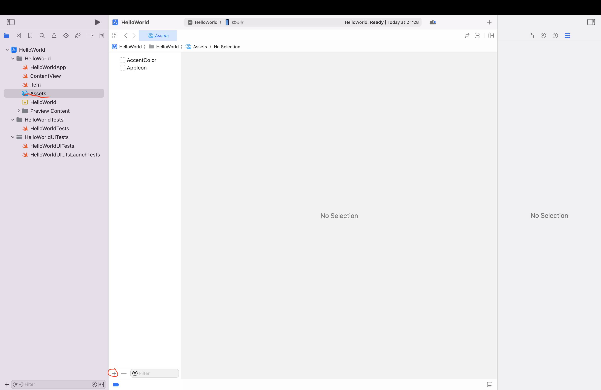
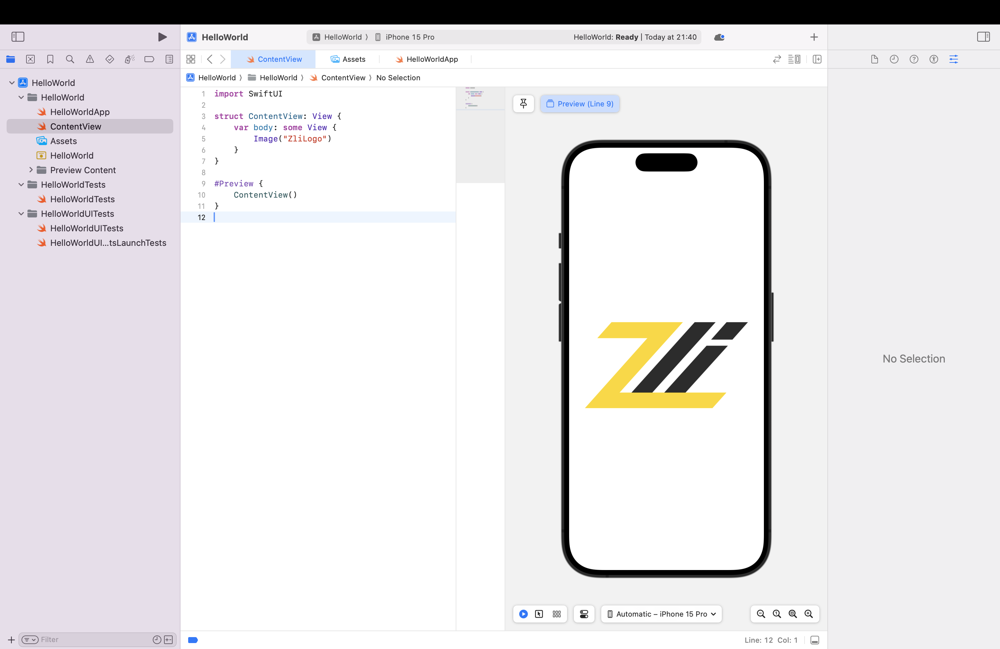

# SwiftUI
## 画面表示
### 1. はじめに

SwiftUIはAppleが提供する宣言型フレームワークで、iOS、macOS、watchOS、tvOS向けにユーザーインターフェースを簡単に作成できます。この講義では、SwiftUIの基本的な使い方を学び、シンプルなUIを構築する方;法を実践的に学びます。

### 2. 基本的なViewの作成

#### 2.1 Textの表示

Textは文字列を表示するための基本的なViewです。以下のコードでは、"Hello, SwiftUI!"という文字列を表示します。

```swift
import SwiftUI

struct ContentView: View {
    var body: some View {
        Text("Hello, SwiftUI!")
            .font(.largeTitle)
            .fontWeight(.bold)
            .foregroundColor(.blue)
            .padding()
    }
}
```
**説明**
- `font(.largeTitle)`: 文字のサイズを大きく設定します。
- `fontWeight(.bold)`: 文字を太字にします。
- `foregroundColor(.blue)`: 文字の色を青にします。
- `padding()`: 余白を追加します。

#### 2.2 Imageの表示

Imageは画像を表示するためのViewです。以下のコードでは、システムアイコン「star.fill」を表示します。

```swift
import SwiftUI

struct ContentView: View {
    var body: some View {
        Image(systemName: "star.fill")
            .imageScale(.large)
            .foregroundColor(.yellow)
            .padding()
    }
}
```

**説明**:
- `systemName`: システムが提供するアイコン名を指定します。
- `imageScale(.large)`: 画像のサイズを大きくします。
- `foregroundColor(.yellow)`: 画像の色を黄色にします。
- `padding()`: 余白を追加します。

#### 2.3 保存した画像の表示

保存した画像を表示するには、Assetsを開き＋を押して画像を追加してください。



追加したら、以下のようにコードを書けば画像を表示することができます。

```swift
import SwiftUI

struct ContentView: View {
    var body: some View {
        // 追加した画像の名前
        Image("ZliLogo")
    }
}
```



### 3. メンバーアクセス演算子

Swiftにおけるメンバーアクセス演算子（`.`）は、構造体、クラス、または列挙型のインスタンスのプロパティやメソッドにアクセスするために使用されます。これにより、オブジェクトの内部データや機能に簡単にアクセスできます。

#### 3.1 メンバーアクセス演算子の使用例

以下の例では、`Person`構造体のインスタンスのプロパティにアクセスしています。

```swift
struct Person {
    var name: String
    var age: Int
}

let person = Person(name: "John", age: 30)
print(person.name) // "John"
print(person.age)  // 30
```

ここで、`person.name`と`person.age`はそれぞれ`Person`構造体の`name`と`age`プロパティにアクセスしています。

#### 3.2 SwiftUIでの使用

SwiftUIでは、メンバーアクセス演算子を使用してビューのプロパティやメソッドを適用します。例えば、テキストの色やフォントサイズを変更する場合などです。

```swift
Text("Hello, SwiftUI!")
    .font(.largeTitle)
    .fontWeight(.bold)
    .foregroundColor(.blue)
    .padding()
```

この例では、`Text`ビューのインスタンスに対して一連のメソッドをチェーンして適用しています。

**説明**
- `.font(.largeTitle)`: 文字のサイズを大きく設定します。
- `.fontWeight(.bold)`: 文字を太字にします。
- `.foregroundColor(.blue)`: 文字の色を青にします。
- `.padding()`: 余白を追加します。

#### 3.3 カスタムメソッドの追加

自分で定義したカスタムメソッドを使用して、ビューのプロパティを変更することも可能です。以下は、カスタムビューを作成し、そのメソッドを使用する例です。

```swift
import SwiftUI

struct CustomTextView: View {
    var text: String

    var body: some View {
        Text(text)
            .customStyle()
    }
}

extension View {
    func customStyle() -> some View {
        self
            .font(.title)
            .fontWeight(.semibold)
            .foregroundColor(.green)
            .padding()
    }
}

struct ContentView: View {
    var body: some View {
        CustomTextView(text: "Hello, Custom Style!")
    }
}
```

**説明**
- `customStyle()`: カスタムメソッドを定義し、`View`に適用します。
- `CustomTextView`: テキストビューを作成し、`customStyle`メソッドを適用します。

このように、メンバーアクセス演算子を使用することで、SwiftやSwiftUIでのコーディングがより直感的かつ効率的になります。

#### 3.4 メジャーなメンバーアクセスの例

以下に、SwiftUIでよく使用されるメンバーアクセス演算の例を挙げ、それぞれの機能を説明します。

1. **`.padding()`**
    - ビューの周りに余白を追加します。
    ```swift
    Text("Hello, SwiftUI!")
        .padding()
    ```

2. **`.background()`**
    - ビューの背景に色や他のビューを設定します。
    ```swift
    Text("Hello, SwiftUI!")
        .background(Color.yellow)
    ```

3. **`.foregroundColor()`**
    - テキストや画像の色を変更します。
    ```swift
    Text("Hello, SwiftUI!")
        .foregroundColor(.red)
    ```

4. **`.font()`**
    - テキストのフォントスタイルを設定します。
    ```swift
    Text("Hello, SwiftUI!")
        .font(.largeTitle)
    ```

5. **`.cornerRadius()`**
    - ビューの角を丸くします。
    ```swift
    Rectangle()
        .cornerRadius(10)
    ```

6. **`.shadow()`**
    - ビューに影を追加します。
    ```swift
    Text("Hello, SwiftUI!")
        .shadow(radius: 10)
    ```

7. **`.frame()`**
    - ビューのサイズを設定します。
    ```swift
    Text("Hello, SwiftUI!")
        .frame(width: 200, height: 100)
    ```

8. **`.opacity()`**
    - ビューの透明度を設定します。
    ```swift
    Text("Hello, SwiftUI!")
        .opacity(0.5)
    ```

9. **`.border()`**
    - ビューに境界線を追加します。
    ```swift
    Text("Hello, SwiftUI!")
        .border(Color.black, width: 2)
    ```

10. **`.clipShape()`**
    - ビューを特定の形状にクリップします。
    ```swift
    Image(systemName: "star.fill")
        .clipShape(Circle())
    ```

これらのメンバーアクセス演算を組み合わせることで、SwiftUIで豊かで複雑なユーザーインターフェースを簡単に構築することができます。

### 4. Buttonと@State

#### 4.1 Buttonの使用方法

`Button`は、ユーザーがタップしたときに特定のアクションを実行するためのインターフェース要素です。`Button`の基本的な使用方法は次のとおりです。

```swift
Button(action: {
    // ボタンが押されたときに実行するアクション
    print("Button was tapped!")
}) {
    // ボタンのラベル
    Text("Tap me!")
}
```

**説明**
- `action`: ボタンが押されたときに実行されるクロージャ。
- ラベル: ボタンに表示されるコンテンツ（ここでは`Text("Tap me!")`）。

#### 4.2 @Stateの使用方法

`@State`は、SwiftUIでビューの状態を管理するためのプロパティラッパーです。状態が変更されると、関連するビューが再描画されます。

```swift
import SwiftUI

struct ContentView: View {
    @State private var isTapped: Bool = false

    var body: some View {
        VStack {
            Text(isTapped ? "Button was tapped!" : "Tap the button")
                .padding()

            Button(action: {
                self.isTapped.toggle()
            }) {
                Text("Tap me!")
            }
            .padding()
        }
    }
}
```

**説明**
- `@State private var isTapped: Bool = false`: `isTapped`は、ボタンが押されたかどうかを追跡するための状態変数です。
- `Text(isTapped ? "Button was tapped!" : "Tap the button")`: `isTapped`の値に応じて表示するテキストを変更します。
- `Button(action: { self.isTapped.toggle() })`: ボタンが押されたときに`isTapped`の値を反転させます。

**Tips**: `isTapped ? "Button was tapped!" : "Tap the button"` といった書き方は三項演算子と呼ばれます。`isTapped`が`true`ならば`"Button was tapped!"`、`isTapped`が`false`なら`"Tap the button"`を表示します。三項演算子を使うと、`if`文を使わなくて済み、コードが簡潔で読みやすくなります。

このように、`Button`と`@State`を組み合わせることで、ユーザーの操作に応じて動的に変化するインターフェースを簡単に作成できます。`@State`を使用することで、状態管理が容易になり、ビューの更新が自動的に行われるため、SwiftUIでの開発が効率的に進められます。

### 5. Viewの組み合わせ

#### 5.1 VStack

VStackはViewを縦に積み重ねるためのコンテナです。以下のコードでは、TextとImageを縦に並べます。

```swift
import SwiftUI

struct ContentView: View {
    var body: some View {
        VStack {
            Text("Hello, SwiftUI!")
                .font(.title)
                .padding()
            Image(systemName: "star.fill")
                .imageScale(.large)
                .foregroundColor(.yellow)
        }
    }
}
```

#### 5.2 HStack

HStackはViewを横に並べるためのコンテナです。以下のコードでは、TextとImageを横に並べます。

```swift
import SwiftUI

struct ContentView: View {
    var body: some View {
        HStack {
            Text("Hello, SwiftUI!")
                .font(.title)
                .padding()
            Image(systemName: "star.fill")
                .imageScale(.large)
                .foregroundColor(.yellow)
        }
    }
}
```

#### 5.3 ZStack

ZStackはViewを重ねるためのコンテナです。以下のコードでは、TextとImageを重ねて表示します。

```swift
import SwiftUI

struct ContentView: View {
    var body: some View {
        ZStack {
            Image(systemName: "star.fill")
                .imageScale(.large)
                .foregroundColor(.yellow)
            Text("Hello, SwiftUI!")
                .font(.title)
                .foregroundColor(.white)
                .padding()
                .background(Color.black)
        }
    }
}
```

### 6. カスタムViewの作成

再利用可能なコンポーネントを作成するために、カスタムViewを作成します。以下のコードでは、カスタムViewを作成し、それをContentView内で使用します。

```swift
import SwiftUI

struct CustomView: View {
    var body: some View {
        VStack {
            Text("This is a custom view")
                .font(.headline)
                .padding()
            Image(systemName: "star.fill")
                .imageScale(.large)
                .foregroundColor(.yellow)
        }
    }
}

struct ContentView: View {
    var body: some View {
        CustomView()
    }
}
```

**説明**:
- `CustomView`: 新しいカスタムViewを作成します。
- `ContentView`: カスタムViewを使用して表示します。

### 7. まとめ

この講義では、SwiftUIを使った基本的なViewの作成方法と、それらを組み合わせる方法を学びました。これらの基本を理解することで、複雑なUIを作成する基礎を築くことができます。今後は、これらの知識を基により複雑なUIコンポーネントを作成し、アプリケーションを豊かにしていきましょう。


