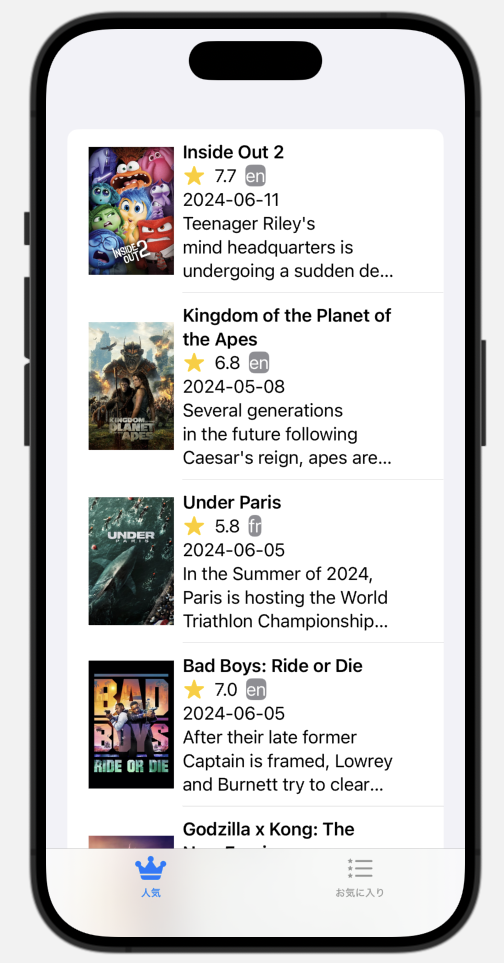

## APIについて

### APIとは

**API**（エーピーアイ）は「アプリケーション・プログラミング・インターフェース」の略です。これが何かを簡単に言うと、**「アプリ同士が話すための言葉やルール」**です。普段、私たちが直接目にするものではありませんが、いろんなアプリやサービスが裏で使っているものです。

### APIの具体例

#### 例1: 天気アプリ

例えば、スマートフォンの天気アプリを考えてみましょう。天気アプリが最新の天気情報を表示するために、気象情報を提供するサービス（例えば、気象庁や気象会社）のデータが必要です。ここでAPIが登場します。

- **天気アプリ**は、「今日の天気を教えて！」とAPIを通じて気象情報サービスにリクエストを送ります。
- **気象情報サービス**は、そのリクエストを受け取り、「今日の天気は晴れ、気温は25度だよ！」とAPIを通じてデータを返します。

#### 例2: 地図アプリ

地図アプリも同じようにAPIを使っています。例えば、お店の場所を検索したい時、地図アプリは地図データやお店のデータを提供するサービスにリクエストを送ります。

- **地図アプリ**：「この住所のお店を教えて！」
- **地図データサービス**：「その住所のお店はここだよ！」と返す。

#### APIの役割

APIの役割は、**異なるアプリやサービスが簡単にお互いのデータや機能を使えるようにすること**です。

#### APIがないとどうなる？

APIがなかったら、アプリ同士が情報をやり取りするのはとても難しくなります。例えば、天気アプリが自分で全部の気象データを集めなきゃいけなくなったり、地図アプリが自分で全部の地図を描かなきゃいけなくなります。そうなると、アプリを作るのが大変になりますし、使う側も便利さが減ってしまいます。

#### 日常生活でのAPI

普段私たちは意識しないですが、APIは私たちの生活の中でたくさん使われています。

- **SNS**: 写真をアップロードしたり、友達の投稿を見たりする時。
- **ネットショッピング**: 商品を検索したり、在庫状況を確認したりする時。
- **スマホのアプリ連携**: カレンダーアプリがメールの予定を読み込んだりする時。

#### まとめ

APIは、**アプリ同士が効率的に情報をやり取りするための「言葉」と「ルール」** です。これがあるおかげで、いろんなアプリやサービスが連携して、私たちの生活を便利にしてくれているのです。

### APIの使い方

今回は、気象庁のお天気情報を取得するAPIを利用して解説します。以下がコードとなります。
```swift
import Foundation

let url = URL(string: "https://www.jma.go.jp/bosai/forecast/data/forecast/340000.json")!
let request = URLRequest(url: url)
let task = URLSession.shared.dataTask(with: request) { (data, response, error) in
    guard let data = data else {
        print("Error: No data received")
        return
    }
    do {
        let object = try JSONSerialization.jsonObject(with: data, options: [])
        print(object)
    } catch let e {
        print("Error during JSON serialization: \(e)")
    }
}
task.resume()
```
#### 解説

```swift
import Foundation
```
Foundationフレームワークは、Objective-CとSwiftで利用でき、データ管理、文字列操作、日時操作、ネットワーキング、ファイル操作、スレッディング、通知などの多くの基本的な機能をサポートしています。

#### SwiftUIを用いた表示例

```swift
import SwiftUI
import Foundation

struct ContentView: View {
    @State private var formattedData: String = "Loading..."
    
    var body: some View {
        ScrollView {
            Text(formattedData)
                .padding()
                .onAppear {
                    fetchData()
                }
        }
    }
    
    func fetchData() {
        let url = URL(string: "https://www.jma.go.jp/bosai/forecast/data/forecast/070000.json")!
        let task = URLSession.shared.dataTask(with: url) { (data, response, error) in
            guard let data = data else { return }
            do {
                if let jsonObject = try JSONSerialization.jsonObject(with: data, options: []) as? [[String: Any]] {
                    let formattedString = formatData(jsonObject: jsonObject)
                    DispatchQueue.main.async {
                        self.formattedData = formattedString
                    }
                }
            } catch let e {
                DispatchQueue.main.async {
                    self.formattedData = "Error during JSON serialization: \(e)"
                }
            }
        }
        task.resume()
    }
    
    func formatData(jsonObject: [[String: Any]]) -> String {
        guard let firstReport = jsonObject.first else { return "No data available" }
        
        var result = ""
        
        if let publishingOffice = firstReport["publishingOffice"] as? String {
            result += "発表機関: \(publishingOffice)\n\n"
        }
        
        if let reportDatetime = firstReport["reportDatetime"] as? String {
            result += "報告日時: \(reportDatetime)\n\n"
        }
        
        if let timeSeries = firstReport["timeSeries"] as? [[String: Any]], let timeDefines = timeSeries.first?["timeDefines"] as? [String], let areas = timeSeries.first?["areas"] as? [[String: Any]] {
            
            for area in areas {
                if let areaInfo = area["area"] as? [String: Any], let areaName = areaInfo["name"] as? String {
                    result += "地域: \(areaName)\n"
                }
                
                if let weatherCodes = area["weatherCodes"] as? [String], let weathers = area["weathers"] as? [String], let winds = area["winds"] as? [String] {
                    for (index, time) in timeDefines.enumerated() {
                        result += "日時: \(time)\n"
                        result += "天気コード: \(weatherCodes[index])\n"
                        result += "天気: \(weathers[index])\n"
                        result += "風: \(winds[index])\n\n"
                    }
                }
            }
        }
        
        return result
    }
}

#Preview {
    ContentView()
}

```


#### 構造体でデータを管理する

```swift
import SwiftUI
import SDWebImageSwiftUI


// Movie構造体: 映画の情報を格納するためのモデルです。
// IdentifiableはIDを持つことを意味し、DecodableとEncodableはJSONエンコーディング/デコーディングをサポートすることを意味します。
struct Movie: Identifiable, Decodable, Encodable {
    // プロパティ: 映画の各種情報を定義
    var id: Int
    var title: String
    var thumbnailURL: String
    var overview: String
    var release_date: String
    var vote_average: Float
    var original_language: String
    // ...
    // CodingKeys: JSONのキーとプロパティのマッピングを定義
    private enum CodingKeys: String, CodingKey {
        case id
        case title
        case thumbnailURL = "poster_path"
        case overview
        case release_date
        case vote_average
        case original_language
    }
}

// PopularViewModel: 映画のリストをフェッチして保持するためのViewModel。
class PopularViewModel: ObservableObject {
    @Published var movies: [Movie] = []

    func fetchPopularMovies() {
        guard let accessToken = ProcessInfo.processInfo.environment["API_read_access_token"] else {
            print("Access token not found")
            return
        }

        guard let url = URL(string: "https://api.themoviedb.org/3/movie/popular") else {
            print("Invalid URL")
            return
        }

        var request = URLRequest(url: url)
        request.setValue("Bearer \(accessToken)", forHTTPHeaderField: "Authorization")
        request.httpMethod = "GET"

        // APIから映画データを取得し、JSONとしてデコードする処理
        URLSession.shared.dataTask(with: request) { data, response, error in
            if let data = data {
                // APIからの応答をプリントして確認
                print(String(data: data, encoding: .utf8) ?? "Invalid response")

                do {
                    let decodedResponse = try JSONDecoder().decode(MovieResponse.self, from: data)
                    DispatchQueue.main.async {
                        self.movies = decodedResponse.results
                    }
                } catch {
                    print("Decoding failed: \(error)")
                }
            }

        }.resume()
    }
}

// MovieResponse構造体: APIレスポンスのためのモデルです。
struct MovieResponse: Decodable {
    var results: [Movie]
}

// PopularView: UIを表現するViewコンポーネント。
struct PopularView: View {
    @StateObject var viewModel = PopularViewModel()
    @State private var favoritedMovies: [Int: Bool] = [:]
    @State private var showingDetails = false
    @State private var selectedMovie: Movie?

    var body: some View {
        // 映画リストを表示するためのリストビュー
        List(viewModel.movies, id: \.id) { movie in
            // 各映画のレイアウトを定義
            HStack {
                // 映画の画像を表示
                // SDWebImageSwiftUIを使用して映画の画像を表示
                WebImage(url: URL(string: "https://image.tmdb.org/t/p/w500\(movie.thumbnailURL)"))
                    .resizable()
                    .frame(width: 80, height: 120)

                VStack(alignment: .leading) {
                    // 映画のタイトルや評価などの詳細を表示
                    Text(movie.title)
                        .bold()
                        .frame(width: 200, alignment: .leading)

                    HStack {
                        Image(systemName: "star.fill")
                            .foregroundColor(.yellow)
                        Text(String(format: "%.1f", movie.vote_average))
                        Text(movie.original_language)
                            .foregroundColor(.white)
                            .background(.gray)
                            .cornerRadius(5.0)
                    }

                    Text(movie.release_date)
                        .frame(width: 200, alignment: .leading)

                    Text(movie.overview)
                        .frame(width: 200, alignment: .leading)
                        .lineLimit(3)
                        .truncationMode(.tail)
                }
            }
            .onTapGesture {
                            self.selectedMovie = movie
                            self.showingDetails = true
                        }
        }
        .sheet(isPresented: $showingDetails) {
                    // 映画の詳細を表示するビュー
                    if let movie = selectedMovie {
                        MovieDetailView(movie: movie)
                    }
                }
        // ビューが表示された時と更新が必要な時に映画リストをフェッチ
        .onAppear {
            viewModel.fetchPopularMovies()
        }
        .refreshable {
            viewModel.fetchPopularMovies()
        }
    }

    private func saveToFavorites(saveMovie: Movie) {
        // 選択した映画をお気に入りに保存するロジック
        let encoder = JSONEncoder()
        if let encoded = try? encoder.encode(saveMovie) {
            let count = UserDefaults.standard.integer(forKey: "count")
            var isDuplicate = false

            for i in 1...count {
                if let savedData = UserDefaults.standard.object(forKey: String(i)) as? Data,
                   let savedMovie = try? JSONDecoder().decode(Movie.self, from: savedData) {
                    if savedMovie.id == saveMovie.id {
                        // 重複が見つかった場合、削除
                        UserDefaults.standard.removeObject(forKey: String(i))
                        isDuplicate = true
                        break
                    }
                }
            }

            if !isDuplicate {
                // 新しい映画を保存
                UserDefaults.standard.set(encoded, forKey: String(count + 1))
                UserDefaults.standard.set(count + 1, forKey: "count")
            }
        }
        
    }
}


// MovieDetailView: 映画の詳細情報を表示するためのビュー
struct MovieDetailView: View {
    var movie: Movie
    @State private var isFavorite: Bool = false

    
    var body: some View {
        VStack {
            // 映画の詳細情報を表示
            Text(movie.title).font(.title)
            WebImage(url: URL(string: "https://image.tmdb.org/t/p/w500\(movie.thumbnailURL)"))
                .resizable()
                .frame(width: 200, height: 300)
            Text("Release Date: \(movie.release_date)")
            Text("Rating: \(String(movie.vote_average))")
            Text("Language: \(movie.original_language)")
            Text("Overview:")
                .font(.headline)
            ScrollView {
                Text(movie.overview)
            }
            // お気に入りボタン
            Button(action: {
                self.isFavorite.toggle()
                saveToFavorites(saveMovie: movie)
            }) {
                Text(isFavorite ? "お気に入りを解除する" : "お気に入り登録する")
                    .foregroundColor(.white)
                                   .frame(minWidth: 0, maxWidth: .infinity)
                                   .padding()
                                   .background(isFavorite ? Color.gray : Color.blue)
                                   .cornerRadius(10)
            }
        }
        .padding()
    }
    private func saveToFavorites(saveMovie: Movie) {
        // 選択した映画をお気に入りに保存するロジック
        let encoder = JSONEncoder()
        if let encoded = try? encoder.encode(saveMovie) {
            let count = UserDefaults.standard.integer(forKey: "count")
            var isDuplicate = false

            for i in 1...count {
                if let savedData = UserDefaults.standard.object(forKey: String(i)) as? Data,
                   let savedMovie = try? JSONDecoder().decode(Movie.self, from: savedData) {
                    if savedMovie.id == saveMovie.id {
                        // 重複が見つかった場合、削除
                        UserDefaults.standard.removeObject(forKey: String(i))
                        isDuplicate = true
                        break
                    }
                }
            }

            if !isDuplicate {
                // 新しい映画を保存
                UserDefaults.standard.set(encoded, forKey: String(count + 1))
                UserDefaults.standard.set(count + 1, forKey: "count")
            }
        }
        
    }
    
    private func checkIfFavorite(_ movie: Movie) -> Bool {
            let count = UserDefaults.standard.integer(forKey: "count")
            for i in 1...count {
                if let savedData = UserDefaults.standard.object(forKey: String(i)) as? Data,
                   let savedMovie = try? JSONDecoder().decode(Movie.self, from: savedData) {
                    if savedMovie.id == movie.id {
                        return true
                    }
                }
            }
            return false
        }
}

```

