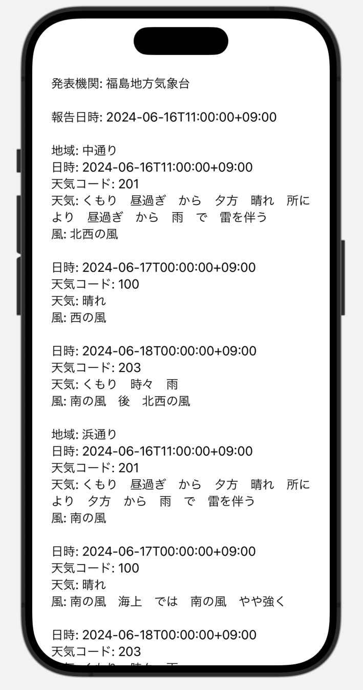

## APIについて

### APIとは

**API**（エーピーアイ）は「アプリケーション・プログラミング・インターフェース」の略です。これが何かを簡単に言うと、**「アプリ同士が話すための言葉やルール」**です。普段、私たちが直接目にするものではありませんが、いろんなアプリやサービスが裏で使っているものです。

### APIの具体例

#### 例1: 天気アプリ

例えば、スマートフォンの天気アプリを考えてみましょう。天気アプリが最新の天気情報を表示するために、気象情報を提供するサービス（例えば、気象庁や気象会社）のデータが必要です。ここでAPIが登場します。

- **天気アプリ**は、「今日の天気を教えて！」とAPIを通じて気象情報サービスにリクエストを送ります。
- **気象情報サービス**は、そのリクエストを受け取り、「今日の天気は晴れ、気温は25度だよ！」とAPIを通じてデータを返します。

#### 例2: 地図アプリ

地図アプリも同じようにAPIを使っています。例えば、お店の場所を検索したい時、地図アプリは地図データやお店のデータを提供するサービスにリクエストを送ります。

- **地図アプリ**：「この住所のお店を教えて！」
- **地図データサービス**：「その住所のお店はここだよ！」と返す。

#### APIの役割

APIの役割は、**異なるアプリやサービスが簡単にお互いのデータや機能を使えるようにすること**です。

#### APIがないとどうなる？

APIがなかったら、アプリ同士が情報をやり取りするのはとても難しくなります。例えば、天気アプリが自分で全部の気象データを集めなきゃいけなくなったり、地図アプリが自分で全部の地図を描かなきゃいけなくなります。そうなると、アプリを作るのが大変になりますし、使う側も便利さが減ってしまいます。

#### 日常生活でのAPI

普段私たちは意識しないですが、APIは私たちの生活の中でたくさん使われています。

- **SNS**: 写真をアップロードしたり、友達の投稿を見たりする時。
- **ネットショッピング**: 商品を検索したり、在庫状況を確認したりする時。
- **スマホのアプリ連携**: カレンダーアプリがメールの予定を読み込んだりする時。

#### まとめ

APIは、**アプリ同士が効率的に情報をやり取りするための「言葉」と「ルール」** です。これがあるおかげで、いろんなアプリやサービスが連携して、私たちの生活を便利にしてくれているのです。

### APIの使い方

今回は、気象庁のお天気情報を取得するAPIを利用して解説します。以下がコードとなります。
```swift
import Foundation

let url = URL(string: "https://www.jma.go.jp/bosai/forecast/data/forecast/340000.json")!
let request = URLRequest(url: url)
let task = URLSession.shared.dataTask(with: request) { (data, response, error) in
    guard let data = data else {
        print("Error: No data received")
        return
    }
    do {
        let object = try JSONSerialization.jsonObject(with: data, options: [])
        print(object)
    } catch let e {
        print("Error during JSON serialization: \(e)")
    }
}
task.resume()
```
#### 解説

```swift
import Foundation
```
Foundationフレームワークは、Objective-CとSwiftで利用でき、データ管理、文字列操作、日時操作、ネットワーキング、ファイル操作、スレッディング、通知などの多くの基本的な機能をサポートしています。

#### SwiftUIを用いた表示例

```swift
import SwiftUI
import Foundation

struct ContentView: View {
    @State private var formattedData: String = "Loading..."
    
    var body: some View {
        ScrollView {
            Text(formattedData)
                .padding()
                .onAppear {
                    fetchData()
                }
        }
    }
    
    func fetchData() {
        let url = URL(string: "https://www.jma.go.jp/bosai/forecast/data/forecast/070000.json")!
        let task = URLSession.shared.dataTask(with: url) { (data, response, error) in
            guard let data = data else { return }
            do {
                if let jsonObject = try JSONSerialization.jsonObject(with: data, options: []) as? [[String: Any]] {
                    let formattedString = formatData(jsonObject: jsonObject)
                    DispatchQueue.main.async {
                        self.formattedData = formattedString
                    }
                }
            } catch let e {
                DispatchQueue.main.async {
                    self.formattedData = "Error during JSON serialization: \(e)"
                }
            }
        }
        task.resume()
    }
    
    func formatData(jsonObject: [[String: Any]]) -> String {
        guard let firstReport = jsonObject.first else { return "No data available" }
        
        var result = ""
        
        if let publishingOffice = firstReport["publishingOffice"] as? String {
            result += "発表機関: \(publishingOffice)\n\n"
        }
        
        if let reportDatetime = firstReport["reportDatetime"] as? String {
            result += "報告日時: \(reportDatetime)\n\n"
        }
        
        if let timeSeries = firstReport["timeSeries"] as? [[String: Any]], let timeDefines = timeSeries.first?["timeDefines"] as? [String], let areas = timeSeries.first?["areas"] as? [[String: Any]] {
            
            for area in areas {
                if let areaInfo = area["area"] as? [String: Any], let areaName = areaInfo["name"] as? String {
                    result += "地域: \(areaName)\n"
                }
                
                if let weatherCodes = area["weatherCodes"] as? [String], let weathers = area["weathers"] as? [String], let winds = area["winds"] as? [String] {
                    for (index, time) in timeDefines.enumerated() {
                        result += "日時: \(time)\n"
                        result += "天気コード: \(weatherCodes[index])\n"
                        result += "天気: \(weathers[index])\n"
                        result += "風: \(winds[index])\n\n"
                    }
                }
            }
        }
        
        return result
    }
}

#Preview {
    ContentView()
}

```




#### 構造体でデータを管理する

```swift
import SwiftUI
import Foundation

struct Forecast: Codable {
    let publishingOffice: String
    let reportDatetime: String
    let timeSeries: [TimeSeries]
    
    struct TimeSeries: Codable {
        let timeDefines: [String]
        let areas: [Area]
        
        struct Area: Codable {
            let area: AreaInfo
            let weatherCodes: [String]?
            let weathers: [String]?
            let winds: [String]?
            
            struct AreaInfo: Codable {
                let name: String
            }
        }
    }
}

struct ContentView: View {
    @State private var formattedData: String = "Loading..."
    
    var body: some View {
        ScrollView {
            Text(formattedData)
                .padding()
                .onAppear {
                    fetchData()
                }
        }
    }
    
    func fetchData() {
        let url = URL(string: "https://www.jma.go.jp/bosai/forecast/data/forecast/070000.json")!
        let task = URLSession.shared.dataTask(with: url) { (data, response, error) in
            guard let data = data else { return }
            do {
                let forecasts = try JSONDecoder().decode([Forecast].self, from: data)
                let formattedString = formatData(forecasts: forecasts)
                DispatchQueue.main.async {
                    self.formattedData = formattedString
                }
            } catch let e {
                DispatchQueue.main.async {
                    self.formattedData = "Error during JSON serialization: \(e)"
                }
            }
        }
        task.resume()
    }
    
    func formatData(forecasts: [Forecast]) -> String {
        guard let firstReport = forecasts.first else { return "No data available" }
        
        var result = ""
        
        result += "発表機関: \(firstReport.publishingOffice)\n\n"
        result += "報告日時: \(firstReport.reportDatetime)\n\n"
        
        for timeSeries in firstReport.timeSeries {
            for area in timeSeries.areas {
                result += "地域: \(area.area.name)\n"
                
                for (index, time) in timeSeries.timeDefines.enumerated() {
                    result += "日時: \(time)\n"
                    if let weatherCodes = area.weatherCodes, index < weatherCodes.count {
                        result += "天気コード: \(weatherCodes[index])\n"
                    }
                    if let weathers = area.weathers, index < weathers.count {
                        result += "天気: \(weathers[index])\n"
                    }
                    if let winds = area.winds, index < winds.count {
                        result += "風: \(winds[index])\n"
                    }
                    result += "\n"
                }
            }
        }
        
        return result
    }
}

#Preview {
    ContentView()
}


```
